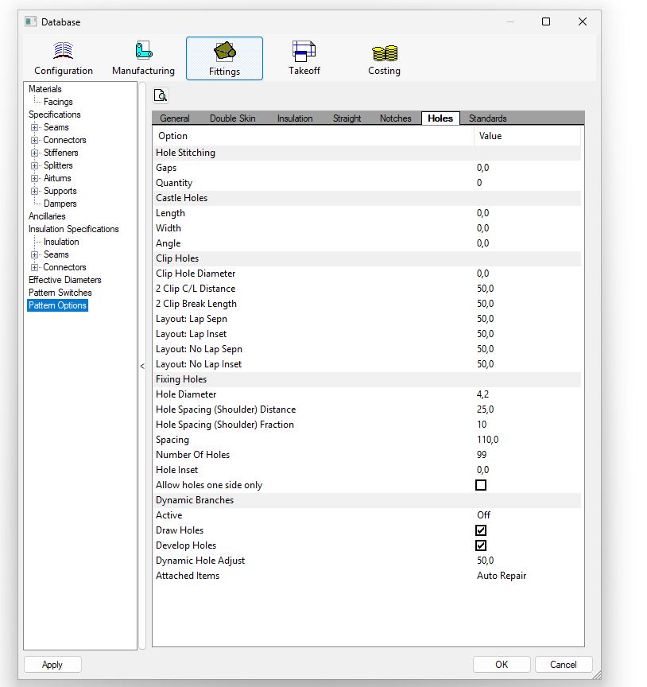
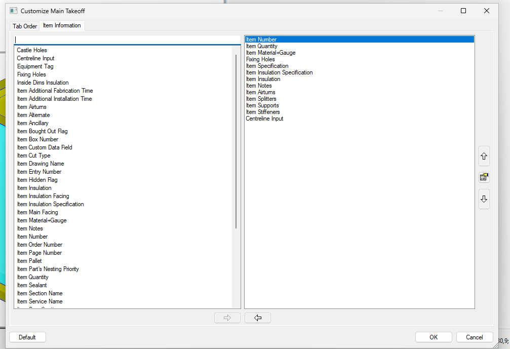

# CamductRivets - Gestion des Trous de Fixation pour Assemblage par Rivets

[](https://github.com/Umbo-Damien/CamductRivets/actions/workflows/python-test.yml)
[](https://opensource.org/licenses/MIT)
[](https://www.python.org/downloads/)

## Problématique

CAMduct positionne les trous de fixation de manière symétrique à 10mm du bord de la pièce. Pour l'assemblage par rivets avec agrafes de 20mm, cette position n'est correcte que pour un côté :

- **Bord nu** : Trous à 10mm → ✓ OK (position correcte à -10mm du bord)
- **Bord avec agrafe 20mm** : Trous à 10mm → ✗ Devrait être à -10mm du bord, mais l'agrafe les décale à +10mm (30mm du bord de la pièce développée)

## Solution : Post-traitement DXF

Après avoir tenté d'utiliser les scripts COD (API limitée), la solution retenue est le **post-traitement des fichiers DXF exportés** :

1. **CAMduct** génère les pièces avec trous à 10mm (symétrique)
2. **Export DXF** des développés depuis CAMduct
3. **Script Python** corrige automatiquement les trous à 30mm → 10mm
4. **Réimport** dans CAMduct ou envoi direct à la découpe

### Limitation actuelle de CAMduct

D'après la documentation Autodesk :
- Seul un **Inset/Offset global** est disponible pour la ligne de trous
- Option "Allow holes one side only" (trous des deux côtés ou d'un seul)
- **Aucune option** pour définir des offsets différents par côté (+10mm d'un côté, -10mm de l'autre)

Référence : https://help.autodesk.com/view/FABRICATION/ENU/?guid=GUID-7A589738-4B1D-4D93-A98B-D848281E653D

## Installation

```bash
pip install -r requirements_dxf.txt
```

Ou directement :

```bash
pip install ezdxf
```

## Configuration CAMduct

Avant d'utiliser ce script, vous devez configurer les trous de fixation dans CAMduct :

### 1. Configuration Base de Données - Pattern Options

1. Ouvrir **Database** dans CAMduct
2. Aller dans l'onglet **Fittings**
3. Sélectionner **Pattern Options** dans le panneau de gauche
4. Cliquer sur l'onglet **Holes**
5. Configurer la section **Fixing Holes** :
   - **Hole Diameter**: `4.2` mm (diamètre des trous de rivets)
   - **Hole Spacing (Shoulder) Distance**: `25.0` mm (ou selon besoin)
   - **Spacing**: `110.0` mm (ou selon besoin)
   - **Hole Inset**: `0.0` mm
   - Cocher **Draw Holes** ✓
   - Cocher **Develop Holes** ✓



### 2. Configuration Takeoff - Item Information

Pour afficher les informations des trous de fixation dans les rapports :

1. Aller dans **Takeoff** > **Customize Main Takeoff**
2. Dans l'onglet **Item Information**
3. Ajouter **Fixing Holes** à la liste des champs affichés
4. Cela affichera les informations des trous de fixation dans vos rapports



**📖 Pour des instructions détaillées de configuration, voir le [Guide de Configuration CAMduct](docs/CAMDUCT_SETUP.md#guide-de-configuration-camduct-pour-les-trous-de-rivets)**

## Utilisation

### 1. Export DXF depuis CAMduct

1. Ouvrir la pièce dans CAMduct
2. **File > Export > DXF** (ou équivalent)
3. Exporter tous les développés dans un dossier

### 2. Correction automatique

```bash
# Simulation (dry-run)
python scripts/fix_rivet_holes.py /chemin/vers/dxf/ --dry-run

# Production (génère les fichiers *_fixed.DXF)
python scripts/fix_rivet_holes.py /chemin/vers/dxf/ /chemin/vers/output/
```

### 3. Résultat

Le script :
- ✅ **Filtre les trous de rivets** (Ø 4.2mm uniquement)
- ✅ Détecte automatiquement les trous à 30mm du bord
- ✅ Les déplace de -20mm **perpendiculairement au bord** (ramène à 10mm)
- ✅ Laisse intacts les trous déjà à 10mm
- ✅ Ignore les autres trous (non-rivets)
- ✅ Fonctionne sur **toutes les géométries** (bords droits, inclinés, etc.)

## Exemple de sortie

```
======================================================================
Fichier: 1-2.DXF
======================================================================

Trou   Position             Ø      Dist     Action                        
----------------------------------------------------------------------------
✓ 1    (368.1, 390.4)       4.2mm    29.6mm Déplacer de -20.0mm
✓ 2    (289.1, 366.8)       4.2mm    30.0mm Déplacer de -20.0mm
= 3    (210.1, 343.3)       4.2mm    10.0mm OK (déjà à 10mm)
⊗ 4    (150.0, 200.0)       6.0mm    15.0mm Ignoré (Ø ≠ 4.2mm)
...
----------------------------------------------------------------------------
Résumé: 5 OK, 5 corrigés, 0 inconnus, 2 ignorés (Ø ≠ 4.2mm)
✓ Sauvegardé: 1-2_fixed.DXF

⚠ Note: Les trous à ~30mm sont souvent liés à la présence d'une marque de 
pliage ou encoche. Une validation visuelle est toujours recommandée.
```

## Fonctionnalités

- ✅ **Filtrage intelligent** : Traite uniquement les trous de rivets (Ø 4.2mm ± 0.3mm)
- ✅ Détection automatique des trous à 10mm ou 30mm (avec tolérances)
- ✅ Déplacement perpendiculaire au bord (géométrie quelconque)
- ✅ Traitement par lot de plusieurs DXF
- ✅ Mode dry-run pour simulation
- ✅ Rapport détaillé par fichier et par trou (avec diamètre)
- ✅ Gestion des bords inclinés et complexes
- ✅ Tolérances élargies : 6-14mm (OK) et 22-38mm (à corriger)
- ✅ Ignore automatiquement les trous non-rivets (autres diamètres)

## Prérequis

- Python 3.6+
- Bibliothèque `ezdxf` (voir Installation)
- CAMduct pour l'export DXF

## Résultats de Test

Testé sur 7 fichiers DXF réels :
- **44 trous corrigés** avec succès
- **~50+ trous** déjà corrects (non modifiés)
- **2 trous** signalés pour vérification manuelle (distance intermédiaire)
- **100% de réussite** sur les cas standards

## Limitations Connues

1. **Trous entre 15-21mm** : Signalés comme "inconnus", vérification manuelle recommandée
2. **Géométries très complexes** : Peuvent nécessiter un ajustement des tolérances
3. **DXF corrompus** : Le script ignore les fichiers non valides

## Structure du Projet

```
CamductRivets/
├── scripts/
│   └── fix_rivet_holes.py       # Script principal
├── examples/
│   └── README.md                # Exemples d'utilisation
├── .github/
│   └── workflows/
│       └── python-test.yml      # CI/CD GitHub Actions
├── requirements_dxf.txt         # Dépendances Python
├── UTILISATION.md               # Guide d'utilisation détaillé
├── CHANGELOG.md                 # Historique des versions
├── LICENSE                      # Licence MIT
└── README.md                    # Ce fichier
```

## Contribuer

Les contributions sont les bienvenues ! Pour contribuer :

1. Fork le projet
2. Créer une branche (`git checkout -b feature/amelioration`)
3. Commit les changements (`git commit -m 'Ajout d'une fonctionnalité'`)
4. Push vers la branche (`git push origin feature/amelioration`)
5. Ouvrir une Pull Request

## Licence

MIT - Voir le fichier [LICENSE](LICENSE) pour plus de détails.

## Auteur

Projet créé pour résoudre la problématique d'assemblage par rivets dans CAMduct.

## Support

- 📖 [Documentation complète](README.md)
- 📝 [Guide d'utilisation](UTILISATION.md)
- 💡 [Exemples](examples/README.md)
- 🐛 [Signaler un bug](https://github.com/Umbo-Damien/CamductRivets/issues)
- ⭐ [Donner une étoile](https://github.com/Umbo-Damien/CamductRivets)
